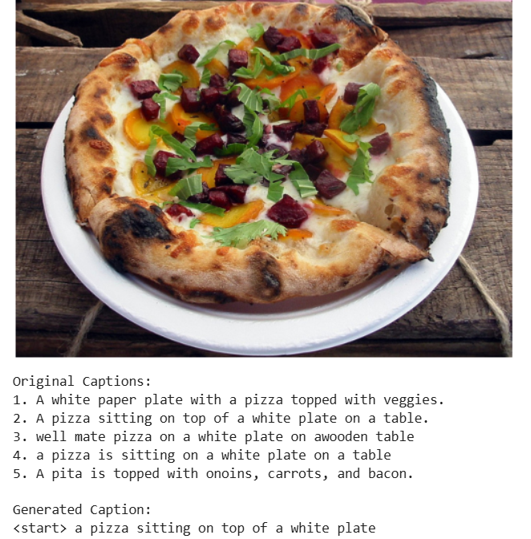
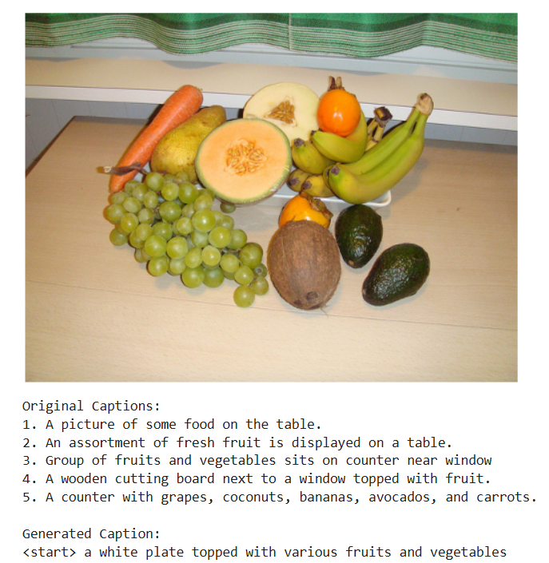
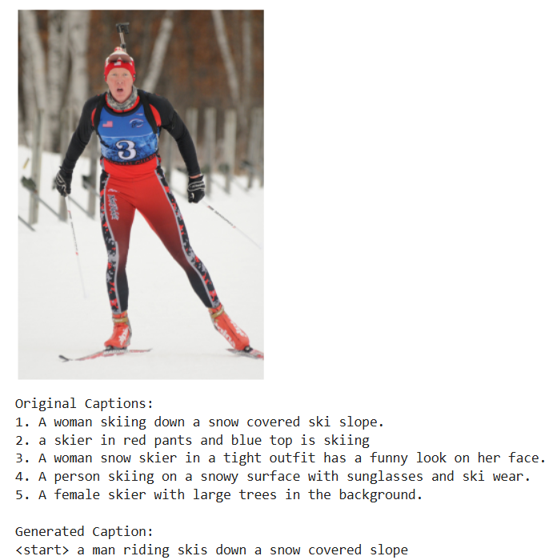
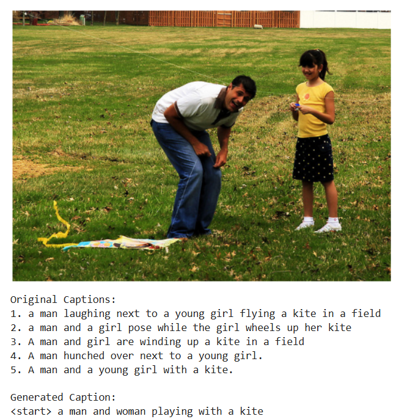

# VisioCap : Image Captioning

This project implements an **image captioning system** that generates natural language descriptions for images.  

It uses a **EfficientNet-B3 Encoder** for extracting visual features and a **LSTM with MultiHead-Attention Decoder** to produce captions.

Also used **Glove200 Embeddings** for text representation.

Performance is evaluated using **BLEU** and **METEOR** scores on a subset of the COCO 2014 dataset.

---

## Dataset

This project uses the **Mini COCO 2014 dataset**, which is a smaller subset of the COCO 2014 dataset containing images with multiple captions.

The Dataset comprising of all images and corresponding captions, is publicly available on [Kaggle](https://www.kaggle.com/datasets/nagasai524/mini-coco2014-dataset-for-image-captioning)

- **Data splits:** Split based on **unique image IDs** to prevent caption leakage across train, validation, and test sets.  

  - **Train:** 74,709 captions (15,026 images)  
  - **Validation:** 9,348 captions (1,878 images)  
  - **Test:** 9,344 captions (1,879 images)  

--- 

## Features

- Preprocessing pipeline for captions (**cleaning, tokenization, padding**).  
- Feature extraction with **EfficientNet-B3** pretrained on ImageNet.  
- **Attention-based LSTM decoder** for caption generation.  
- Training with **label smoothing** and **masking** for padded tokens.  
- Inference with **Beam Search** (beam size = 5).  
- Evaluation using **BLEU-1 → BLEU-4** and **METEOR**.  

---

## Methodology

### 1. Data Preprocessing
- Captions are lowercased and punctuation is removed.  
- Special tokens `<start>` and `<end>` are added.  
- Vocabulary of about **4,500 words** is built.  
- Captions are padded to a maximum length of **20 tokens**.  

### 2. Encoder: EfficientNet-B3
- **EfficientNet-B3** is a convolutional neural network that scales width, depth, and resolution efficiently.  
- Pretrained on **ImageNet** for strong feature representations.  
- Extracted features: `10 × 10 × 1536`, reshaped into `100 × 256` vectors for attention.  

### 3. Decoder: LSTM with Attention
- Pretrained Glove-Word embeddings of size **200**.  
- LSTM with hidden size **512**, initialized from global image features.  
- Attention mechanism dynamically focuses on relevant image regions while generating words.  
- Final dense layer predicts the next word over the vocabulary.  

### 4. Training
- **Loss:** Cross-Entropy with Label Smoothing (ε = 0.1).  
- Masking ensures padding tokens do not affect training.  
- **Optimizer:** Adam with learning rate = 0.0001
- 
### 5. Inference
- Used **Beam Search** (beam width = 5) to generate captions by exploring multiple candidate sequences, improving fluency over **greedy decoding**.
---

## Evaluation Metrics

### 1.BLEU (Bilingual Evaluation Understudy)
Measures **n-gram overlap** between generated and reference captions.

**Results:**  
- **BLEU-1**: 0.71  
- **BLEU-2**: 0.53  
- **BLEU-3**: 0.37  
- **BLEU-4**: 0.26  

### 2.METEOR (Metric for Evaluation of Translation with Explicit ORdering)
Considers **recall, stemming, and synonyms**, making it more semantic than BLEU.

**METEOR:** 0.40  

---

## Sample Images

A few example images used for testing and demonstration are included in the `Images/` folder of this repository.

You can view the folder directly on GitHub here:   [View Images Folder](./Images/)

**Example images:**

## Sample Images 

  
  

--- 

  
  

---

